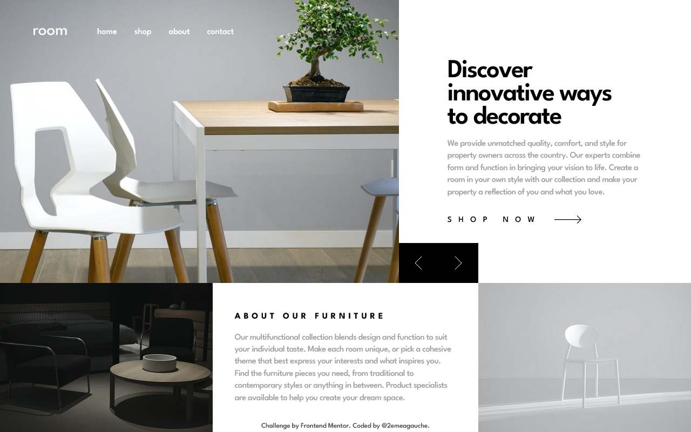

# Frontend Mentor - Room homepage solution

This is a solution to the [Room homepage challenge on Frontend Mentor](https://www.frontendmentor.io/challenges/room-homepage-BtdBY_ENq). Frontend Mentor challenges help you improve your coding skills by building realistic projects. 

## Table of contents

- [Overview](#overview)
  - [The challenge](#the-challenge)
  - [Screenshot](#screenshot)
  - [Links](#links)
- [My process](#my-process)
  - [Built with](#built-with)
  - [What I learned](#what-i-learned)
  - [Continued development](#continued-development)
  - [Useful resources](#useful-resources)
- [Author](#author)

**Note: Delete this note and update the table of contents based on what sections you keep.**

## Overview

### The challenge

Users should be able to:

- View the optimal layout for the site depending on their device's screen size
- See hover states for all interactive elements on the page
- Navigate the slider using either their mouse/trackpad or keyboard

### Screenshot

### Links

- [Solution URL](https://github.com/2emeagauche/frontend-mentor-room-homepage)
- [Live Site URL](https://2emeagauche.github.io/frontend-mentor-room-homepage/)

## My process

### Built with

- Semantic HTML5 markup
- Sass
- Flexbox
- CSS Grid
- Mobile-first workflow
- Vanilla javascript

### What I learned

- Improve my sass dev even though a lot work to do still
- Complex grid placement, using subgrid for desktop layout
- Make it accessible via aria attributes and js
- Lighthouse score of 100 for desktop and 93 for mobile

### Continued development

- Better sass organisation
- renewable components
- making an html blueprint without content to play around

### Useful resources

- [accessible carousel](https://www.adilade.fr/blog/carrousel-accessible-responsive-vanillajs/) (french)
- [Easy and more consistent layouts using subgrid](https://youtu.be/IIQa9f0REtM?si=d4SoAF3-vBQRcVbu) - Kevin Powell youtube channel

## Author

- Website - [Github](https://github.com/2emeagauche)
- Frontend Mentor - [@2emeagauche](https://www.frontendmentor.io/profile/2emeagauche)
